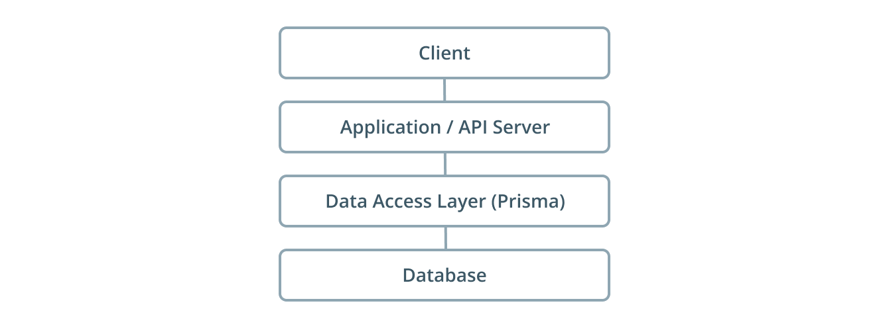

Azure Prisma Server
----
This tutorial will walk you through the steps of deploying a Prisma server on Azure Kubernetes Service (AKS).  

#### What is Prisma?
Prisma is a database abstraction layer that turns your databases into GraphQL APIs with CRUD operations and realtime capabilities. It is the glue between your database and GraphQL server.

GraphQL is a simple yet incredibly powerful abstraction for working with data. Prisma is the first step towards making GraphQL a universal query language by abstracting away the complexity of SQL and other database APIs.




### Prerequisites 

-----

* Azure account (We will be using a free tier account)

## Create Running Kubernetes Cluster in Azure

Login to your Azure portal and type Kubernetes in the search bar at the top of portal page


```sh
$ go run server.go
```

## Code breakdown

```sh
package main

import (
        "fmt"
        "html"
        "log"
        "net/http"
        "time"
)

func main() {

        fmt.Println("It works")
        http.HandleFunc("/", func(w http.ResponseWriter, r *http.Request) {
                now := time.Now()
                fmt.Println("Incoming request from " + r.RemoteAddr + " at ")
                fmt.Println(now)
                fmt.Fprintf(w, "Hello, %q", html.EscapeString(r.URL.Path))
        })

        http.HandleFunc("/golang", func(w http.ResponseWriter, r *http.Request) {
                fmt.Fprintf(w, "Happy Gopher")
        })

        log.Fatal(http.ListenAndServe(":8081", nil))

}
```

Our first HandleFunc function waits for incoming requests to the path "/" and tells our server the IP address of the incoming client and the time the request came in. It also sends a response back to the client with the text `Hello` and any string after the "/". For example, if the client typed `curl http://localhost:8081/bob` they would get a response of "Hello bob".

Our second HandleFunc function simply responds to any incoming requests to `http://localhost:8081/golang` with "Happy Gopher."


License
----

MIT


**Free Software, Hell Yeah!**
